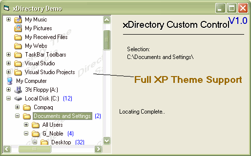



## xDirectory And Custom Tree Control

### Description

Full OwnerDrawn Tree Control To Designed To Simulate A Browse For Folder Structure.

The Advantages Of The Control Other Than Being Very Easy To Use, Is I've Also Made It Customizable (To A Certain Extent).

One Call Will Automatically Load Your Directory Structure.

Set The Property Init To Load The Fonts And Display Them In a Tree Structrue.

(See Sample!)

Set The Property Init To Load Using Custom And Populate The Nodes On Demand.(See Sample Main Menu)

Note: The Fonts And Custom Load Load Does Not Support Icons. You Can Change this As It's Very Simple To See Whats Happening Within the Code.

See Thee Sample Included It Should Explain EveryThing.

As Always Comments And Contructive Critisism Is Awlays Welcome.

Kind Regards

Gary
 
### More Info
 

             |
---                |---
**Submitted On**   |2004-10-08 11:57:44
**By**             |[Phantom Man](https://github.com/Planet-Source-Code/PSCIndex/blob/master/ByAuthor/phantom-man.md)
**Level**          |Advanced
**User Rating**    |5.0 (70 globes from 14 users)
**Compatibility**  |VB 6\.0
**Category**       |[Custom Controls/ Forms/  Menus](https://github.com/Planet-Source-Code/PSCIndex/blob/master/ByCategory/custom-controls-forms-menus__1-4.md)
**World**          |[Visual Basic](https://github.com/Planet-Source-Code/PSCIndex/blob/master/ByWorld/visual-basic.md)
**Archive File**   |[xDirectory1802551082004\.zip](https://github.com/Planet-Source-Code/phantom-man-xdirectory-and-custom-tree-control__1-56598/archive/master.zip)

